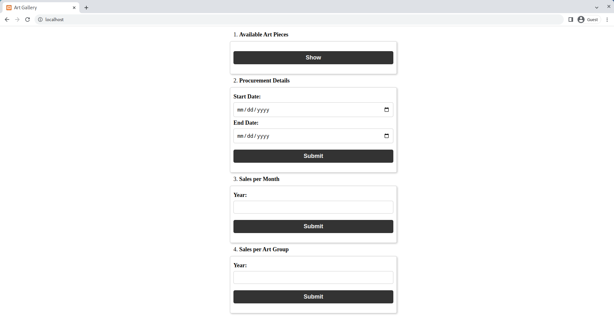
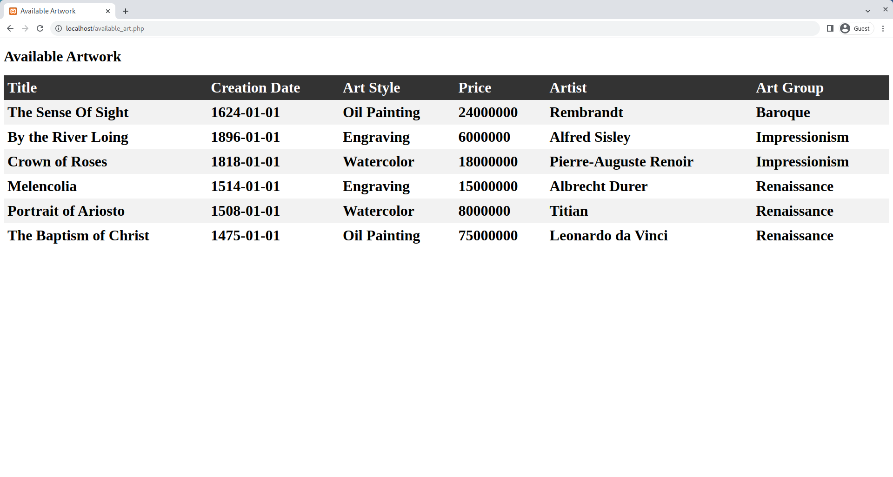
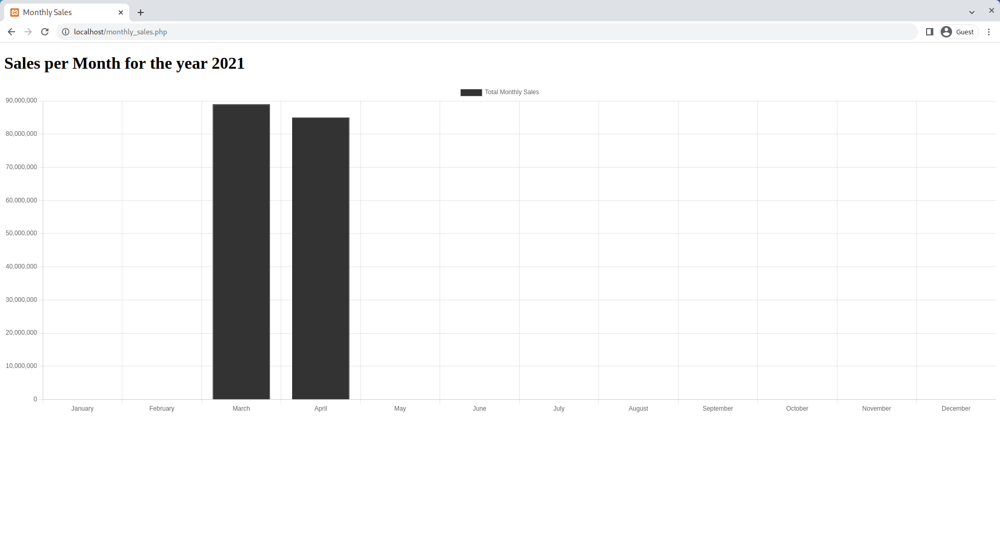
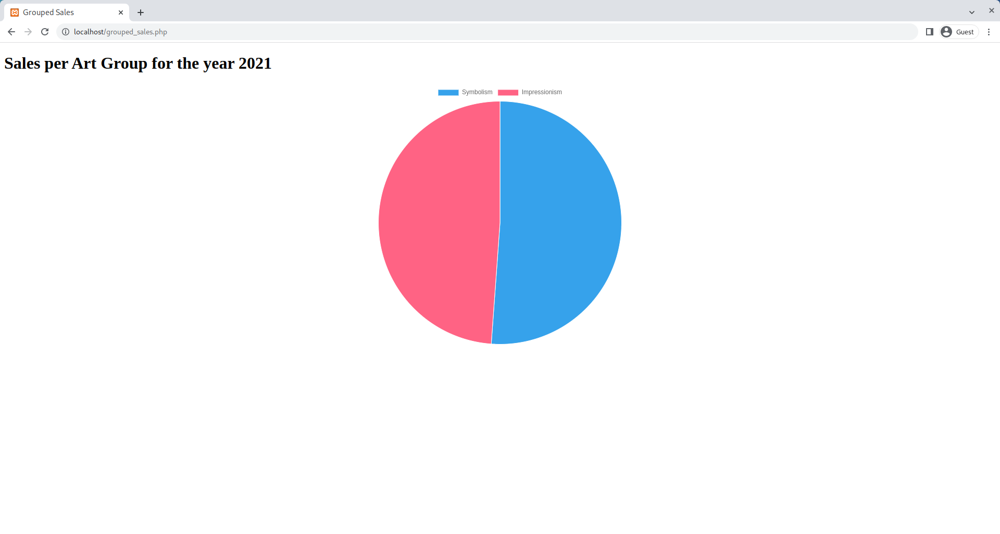

# Problem Statement

Although you always wanted to be an artist, you ended up being an expert on
databases because you love to cook data and you somehow confused 'data base'
with 'data baste'.

Your old love is still there, however, so you set up a database company, ArtBase,
that builds a product for art galleries. The core of this product is a database
with a schema that captures all the information that galleries need to maintain.

- Galleries keep information about artists, their names (which are unique),
  birthplaces, age, and style of art.
- For each piece of artwork, the artist, the year it was made, its unique title,
  its type of art (e.g., painting, lithograph, sculpture, photograph), and its
  price must be stored.
- Pieces of artwork are also classified into groups of various kinds, for
  example, portraits, still life, works by Picasso or works of the 19th century;
  a given piece may belong to more than one group.
  Each group is identified by a name (like those above) that describes the group.
- Finally, galleries keep information about customers. For each customer,
  galleries keep their unique name, address, total amount of dollars they have
  spent in the gallery (very important!), and the artists and groups of art that
  each customer tends to like.
- Each transaction (for the procurement of art-work) needs to be recorded.

You can assume more requirement(s) to make your solution more realistic.

# Reports

1. Generate a report on available artworks with all details including prices.
   The report is to be sorted according to artists in a group.
2. Generate a report on procurement details within a given date range. The
   details should include artwork name, group, artist name, price, date of
   purchase and customer name. The report must be sorted accordingly to the
   group. The subtotal of each group needs to be displayed.
3. Generate a bar graph that displays the sales in each month for a given year.
4. Generate a pie chart that displays the sales of each group for a given year.

# Setup

1. Install [XAMPP](https://www.apachefriends.org/download.html).
2. Start Apache and MySQL via XAMPP.
3. Navigate to http://localhost/phpmyadmin/
4. Paste the contents of [art_gallery.sql](art_gallery.sql) and hit 'Go'.
5. Paste the contents of [art_gallery_data.sql](art_gallery_data.sql) and hit
   'Go'.
6. Copy the contents of [htdocs/](htdocs/) to the htdocs folder at the root of
   the XAMPP installation directory.

# Usage

1. Start Apache and MySQL via XAMPP.
2. Navigate to http://localhost/

# Screenshots

